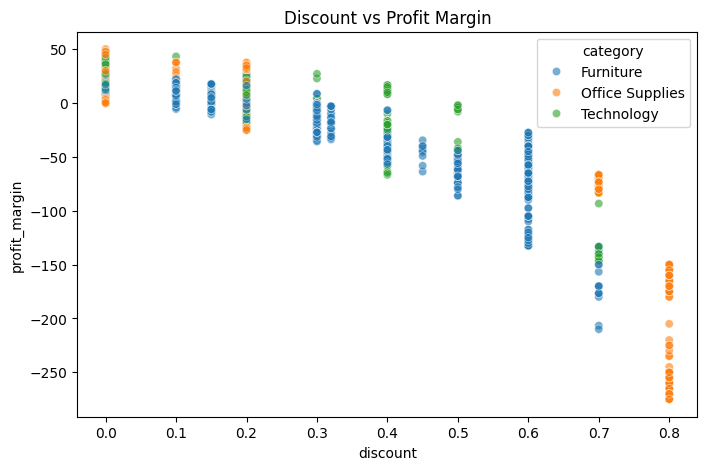

# 📊 Retail ETL Intelligence - Proceso de Análisis
Este notebook detalla el análisis exploratorio de datos (EDA) y el pipeline ETL aplicado al dataset Superstore. Está dirigido a reclutadores y profesionales de datos para revisar la lógica detrás de las transformaciones de datos y los insights presentados en la aplicación Streamlit.

## 1. Configuración del Entorno
Importando las librerías necesarias y cargando los datos sin procesar.


```python
import pandas as pd
import numpy as np
import plotly.express as px
import matplotlib.pyplot as plt
import seaborn as sns

# Load raw dataset
df_raw = pd.read_csv('data/superstore.csv', encoding='windows-1252')
df_raw.head()
```


<div>
<style scoped>
    .dataframe tbody tr th:only-of-type {
        vertical-align: middle;
    }

    .dataframe tbody tr th {
        vertical-align: top;
    }

    .dataframe thead th {
        text-align: right;
    }
</style>
<table border="1" class="dataframe">
  <thead>
    <tr style="text-align: right;">
      <th></th>
      <th>Row ID</th>
      <th>Order ID</th>
      <th>Order Date</th>
      <th>Ship Date</th>
      <th>Ship Mode</th>
      <th>Customer ID</th>
      <th>Customer Name</th>
      <th>Segment</th>
      <th>Country</th>
      <th>City</th>
      <th>...</th>
      <th>Postal Code</th>
      <th>Region</th>
      <th>Product ID</th>
      <th>Category</th>
      <th>Sub-Category</th>
      <th>Product Name</th>
      <th>Sales</th>
      <th>Quantity</th>
      <th>Discount</th>
      <th>Profit</th>
    </tr>
  </thead>
  <tbody>
    <tr>
      <th>0</th>
      <td>1</td>
      <td>CA-2016-152156</td>
      <td>11/8/2016</td>
      <td>11/11/2016</td>
      <td>Second Class</td>
      <td>CG-12520</td>
      <td>Claire Gute</td>
      <td>Consumer</td>
      <td>United States</td>
      <td>Henderson</td>
      <td>...</td>
      <td>42420</td>
      <td>South</td>
      <td>FUR-BO-10001798</td>
      <td>Furniture</td>
      <td>Bookcases</td>
      <td>Bush Somerset Collection Bookcase</td>
      <td>261.9600</td>
      <td>2</td>
      <td>0.00</td>
      <td>41.9136</td>
    </tr>
    <tr>
      <th>1</th>
      <td>2</td>
      <td>CA-2016-152156</td>
      <td>11/8/2016</td>
      <td>11/11/2016</td>
      <td>Second Class</td>
      <td>CG-12520</td>
      <td>Claire Gute</td>
      <td>Consumer</td>
      <td>United States</td>
      <td>Henderson</td>
      <td>...</td>
      <td>42420</td>
      <td>South</td>
      <td>FUR-CH-10000454</td>
      <td>Furniture</td>
      <td>Chairs</td>
      <td>Hon Deluxe Fabric Upholstered Stacking Chairs,...</td>
      <td>731.9400</td>
      <td>3</td>
      <td>0.00</td>
      <td>219.5820</td>
    </tr>
    <tr>
      <th>2</th>
      <td>3</td>
      <td>CA-2016-138688</td>
      <td>6/12/2016</td>
      <td>6/16/2016</td>
      <td>Second Class</td>
      <td>DV-13045</td>
      <td>Darrin Van Huff</td>
      <td>Corporate</td>
      <td>United States</td>
      <td>Los Angeles</td>
      <td>...</td>
      <td>90036</td>
      <td>West</td>
      <td>OFF-LA-10000240</td>
      <td>Office Supplies</td>
      <td>Labels</td>
      <td>Self-Adhesive Address Labels for Typewriters b...</td>
      <td>14.6200</td>
      <td>2</td>
      <td>0.00</td>
      <td>6.8714</td>
    </tr>
    <tr>
      <th>3</th>
      <td>4</td>
      <td>US-2015-108966</td>
      <td>10/11/2015</td>
      <td>10/18/2015</td>
      <td>Standard Class</td>
      <td>SO-20335</td>
      <td>Sean O'Donnell</td>
      <td>Consumer</td>
      <td>United States</td>
      <td>Fort Lauderdale</td>
      <td>...</td>
      <td>33311</td>
      <td>South</td>
      <td>FUR-TA-10000577</td>
      <td>Furniture</td>
      <td>Tables</td>
      <td>Bretford CR4500 Series Slim Rectangular Table</td>
      <td>957.5775</td>
      <td>5</td>
      <td>0.45</td>
      <td>-383.0310</td>
    </tr>
    <tr>
      <th>4</th>
      <td>5</td>
      <td>US-2015-108966</td>
      <td>10/11/2015</td>
      <td>10/18/2015</td>
      <td>Standard Class</td>
      <td>SO-20335</td>
      <td>Sean O'Donnell</td>
      <td>Consumer</td>
      <td>United States</td>
      <td>Fort Lauderdale</td>
      <td>...</td>
      <td>33311</td>
      <td>South</td>
      <td>OFF-ST-10000760</td>
      <td>Office Supplies</td>
      <td>Storage</td>
      <td>Eldon Fold 'N Roll Cart System</td>
      <td>22.3680</td>
      <td>2</td>
      <td>0.20</td>
      <td>2.5164</td>
    </tr>
  </tbody>
</table>
<p>5 rows × 21 columns</p>
</div>


## 2. Exploración Básica de Datos
Veamos la estructura del dataset, los valores nulos y los tipos de datos.


```python
print("Dataset Shape:", df_raw.shape)
print("\nMissing Values:\n", df_raw.isnull().sum()[df_raw.isnull().sum() > 0])
print("\nData Types:\n", df_raw.dtypes)
```

    Dataset Shape: (9994, 21)
    
    Missing Values:
     Series([], dtype: int64)
    
    Data Types:
     Row ID             int64
    Order ID          object
    Order Date        object
    Ship Date         object
    Ship Mode         object
    Customer ID       object
    Customer Name     object
    Segment           object
    Country           object
    City              object
    State             object
    Postal Code        int64
    Region            object
    Product ID        object
    Category          object
    Sub-Category      object
    Product Name      object
    Sales            float64
    Quantity           int64
    Discount         float64
    Profit           float64
    dtype: object
    

## 3. Transformación de Datos (Lógica ETL)
Aquí aplicamos las transformaciones principales utilizadas en nuestro pipeline ETL:
- Análisis de fechas
- Derivación de `days_to_ship`, `profit_margin`, `quarter` y `year`
- Normalización de nombres de columnas


```python
df = df_raw.copy()

# Fix types
df['Order Date'] = pd.to_datetime(df['Order Date'], format='mixed', dayfirst=True)
df['Ship Date'] = pd.to_datetime(df['Ship Date'], format='mixed', dayfirst=True)

# Feature Engineering
df['days_to_ship'] = (df['Ship Date'] - df['Order Date']).dt.days
df['profit_margin'] = (df['Profit'] / df['Sales']) * 100
df['quarter'] = df['Order Date'].dt.quarter
df['year'] = df['Order Date'].dt.year

# Normalizing column names for easier access (snake_case)
df.columns = [col.lower().replace(' ', '_').replace('-', '_') for col in df.columns]

# Drop duplicates
df = df.drop_duplicates()

df[['order_id', 'order_date', 'days_to_ship', 'profit_margin']].head()
```


<div>
<style scoped>
    .dataframe tbody tr th:only-of-type {
        vertical-align: middle;
    }

    .dataframe tbody tr th {
        vertical-align: top;
    }

    .dataframe thead th {
        text-align: right;
    }
</style>
<table border="1" class="dataframe">
  <thead>
    <tr style="text-align: right;">
      <th></th>
      <th>order_id</th>
      <th>order_date</th>
      <th>days_to_ship</th>
      <th>profit_margin</th>
    </tr>
  </thead>
  <tbody>
    <tr>
      <th>0</th>
      <td>CA-2016-152156</td>
      <td>2016-08-11</td>
      <td>92</td>
      <td>16.00</td>
    </tr>
    <tr>
      <th>1</th>
      <td>CA-2016-152156</td>
      <td>2016-08-11</td>
      <td>92</td>
      <td>30.00</td>
    </tr>
    <tr>
      <th>2</th>
      <td>CA-2016-138688</td>
      <td>2016-12-06</td>
      <td>-173</td>
      <td>47.00</td>
    </tr>
    <tr>
      <th>3</th>
      <td>US-2015-108966</td>
      <td>2015-11-10</td>
      <td>-23</td>
      <td>-40.00</td>
    </tr>
    <tr>
      <th>4</th>
      <td>US-2015-108966</td>
      <td>2015-11-10</td>
      <td>-23</td>
      <td>11.25</td>
    </tr>
  </tbody>
</table>
</div>


## 4. Insights Analíticos Clave
### A. Fuga de Rentabilidad en Bookcases (Estanterías) y Tables (Mesas)
Notamos que ciertas sub-categorías tienen márgenes consistentemente negativos debido a altas tasas de descuento.


```python
subcat_profit = df.groupby('sub_category')['profit'].sum().reset_index().sort_values('profit')
print("Bottom 5 Sub-categories by Profit:\n", subcat_profit.head())

# Visualizing Discount vs Profit Margin
fig, ax = plt.subplots(figsize=(8, 5))
sns.scatterplot(data=df, x='discount', y='profit_margin', hue='category', alpha=0.6, ax=ax)
ax.set_title("Discount vs Profit Margin")
plt.show()
```

    Bottom 5 Sub-categories by Profit:
        sub_category      profit
    16       Tables -17725.4811
    4     Bookcases  -3472.5560
    15     Supplies  -1189.0995
    8     Fasteners    949.5182
    11     Machines   3384.7569
    


    

    


### B. Rendimiento de Ventas por Región
Veamos qué regiones impulsan la mayor cantidad de ingresos.


```python
region_sales = df.groupby('region')['sales'].sum().reset_index().sort_values('sales', ascending=False)
display(region_sales)
```


<div>
<style scoped>
    .dataframe tbody tr th:only-of-type {
        vertical-align: middle;
    }

    .dataframe tbody tr th {
        vertical-align: top;
    }

    .dataframe thead th {
        text-align: right;
    }
</style>
<table border="1" class="dataframe">
  <thead>
    <tr style="text-align: right;">
      <th></th>
      <th>region</th>
      <th>sales</th>
    </tr>
  </thead>
  <tbody>
    <tr>
      <th>3</th>
      <td>West</td>
      <td>725457.8245</td>
    </tr>
    <tr>
      <th>1</th>
      <td>East</td>
      <td>678781.2400</td>
    </tr>
    <tr>
      <th>0</th>
      <td>Central</td>
      <td>501239.8908</td>
    </tr>
    <tr>
      <th>2</th>
      <td>South</td>
      <td>391721.9050</td>
    </tr>
  </tbody>
</table>
</div>


## 5. Conclusión
El dataset ha sido limpiado, procesado y exportado a `output/superstore_clean.csv`.
Este análisis alimenta directamente el dashboard de Streamlit, proporcionando filtros dinámicos y soporte multilingüe.
